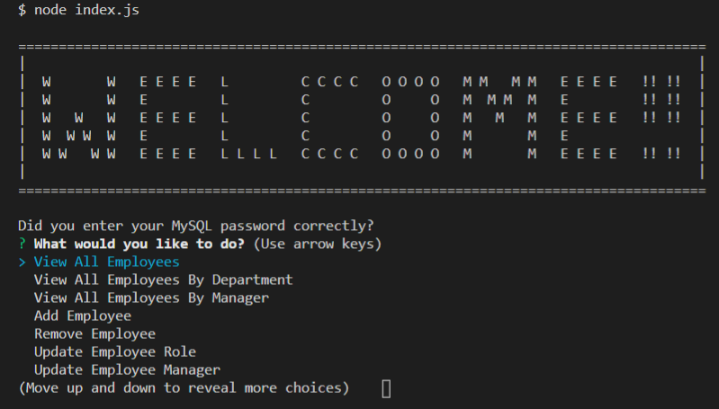

# 12-Employee-Tracker

## Description
As a Full-Stack Web Developer, I have created an application that will allow a company to view, add, remove, and update their employees all in one location. I have created this application so that they can see all of their employees in one location. In order to achieve this, I will utilize Express.js to save user input.

## Table of Contents

* [Title](#Title)
* [Description](#Description)
* [Installation](#Installation)
* [Usage](#Usage)
* [Contributing](#Contributing)

## Installation
Open a new terminal and conduct an "npm install".

## Usage
Open a new terminal and enter "node index.js" to start the console application.

## Contributors
Just me!

## Questions
Coreyburkett22@gmail.com

